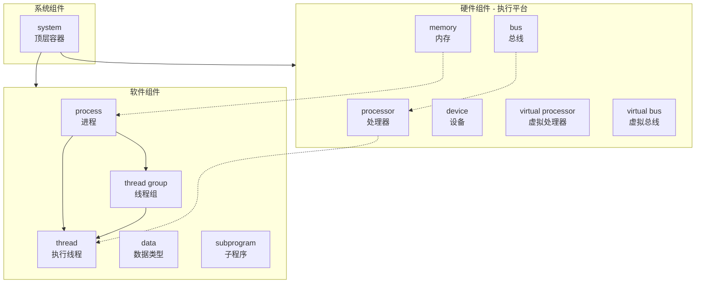
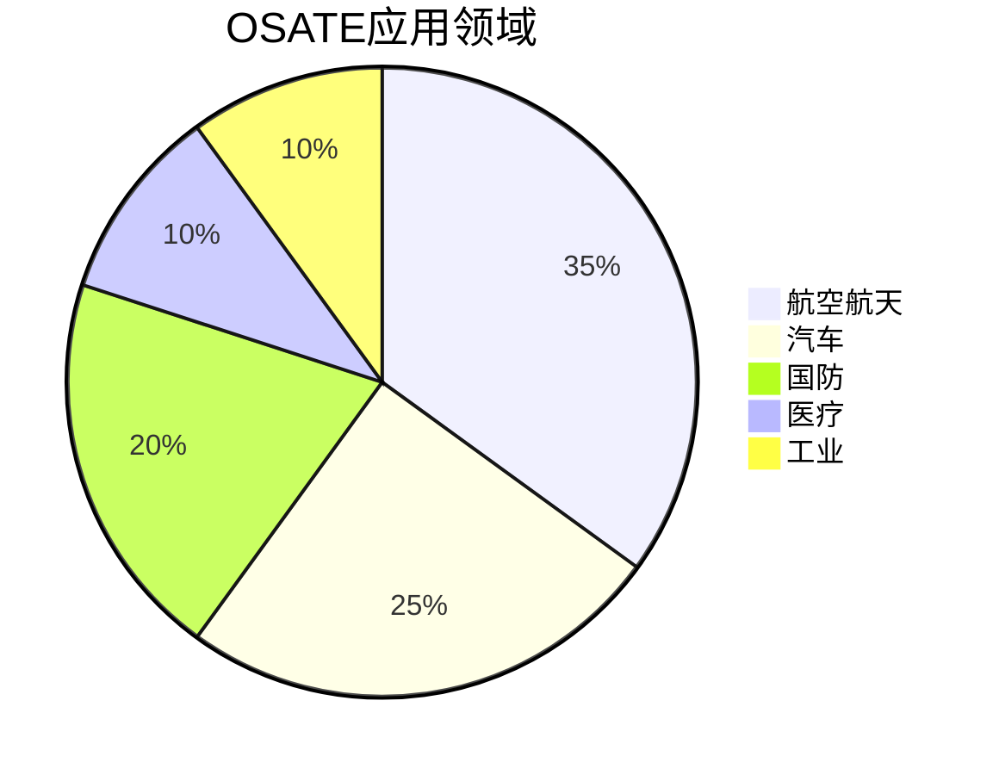

# OSATE2 项目概述

## 1. 什么是OSATE

**OSATE** (Open Source AADL Tool Environment) 是一个基于Eclipse的开源集成开发环境，专门用于支持AADL (Architecture Analysis & Design Language) 的建模、分析和代码生成。

OSATE由卡内基梅隆大学软件工程研究所(SEI)开发和维护，部分资金来自美国政府支持。

### 1.1 核心定位

OSATE是一个完整的**模型驱动工程(MDE)工具链**，为嵌入式实时系统的架构师和工程师提供：

- 语法感知的AADL文本编辑器
- 图形化建模编辑器
- 模型验证和分析工具
- 代码生成能力
- 可扩展的插件架构

### 1.2 版本信息

| 属性 | 值 |
|------|-----|
| 当前版本 | 2.18.0-SNAPSHOT |
| 目标Eclipse | 2025-06 |
| Java版本 | Java SE 21 |
| 许可证 | Eclipse Public License 2.0 |

## 2. 什么是AADL

**AADL** (Architecture Analysis & Design Language) 是由SAE国际标准化的架构描述语言。

### 2.1 历史背景

- AADL最初为航空电子领域开发，早期名为**Avionics Architecture Description Language**
- 由美国陆军部分资助
- 现已扩展到更广泛的嵌入式实时系统领域

### 2.2 语言特点

AADL专门用于建模嵌入式实时系统的软件和硬件架构：

**软件组件类型：**
- `thread` - 执行线程
- `thread group` - 线程组
- `process` - 进程（受保护的地址空间）
- `data` - 数据类型
- `subprogram` - 子程序

**硬件组件类型（执行平台）：**
- `processor` - 处理器
- `memory` - 内存
- `bus` - 总线
- `device` - 设备
- `virtual processor` - 虚拟处理器
- `virtual bus` - 虚拟总线

**系统组件：**
- `system` - 系统（顶层容器）

### 2.3 语言扩展（Annexes）

AADL支持通过附件(Annex)扩展核心语言：

| 附件 | 用途 |
|------|------|
| **Behavior Annex (BA)** | 用状态机描述组件行为 |
| **Error Model V2 (EMV2)** | 故障和错误传播建模 |
| **ARINC653 Annex** | 航空电子系统建模模式 |
| **Data Model Annex** | 特定数据约束 |
| **Requirements Annex** | 需求规范 |

## 3. OSATE的主要功能

### 3.1 建模能力

**文本编辑器：**
- 语法高亮
- 代码补全
- 实时语法检查
- 重构支持
- 大纲视图

**图形编辑器：**
- 拖放式组件创建
- 可视化连接编辑
- 布局自动化
- 与文本模型同步

### 3.2 分析能力

OSATE提供多种架构分析功能：

| 分析类型 | 描述 |
|----------|------|
| **延迟分析** | 计算端到端流的最坏情况响应时间 |
| **资源预算** | 内存、带宽、功耗等资源分析 |
| **安全分析** | 支持ARP4761标准（FHA、FTA、FMEA） |
| **连接性分析** | 验证组件连接完整性 |
| **模式分析** | 系统运行模式分析 |
| **流分析** | 数据流和控制流分析 |

### 3.3 验证与保证

**形式化验证工具：**

- **AGREE** - 基于假设/保证契约的组合验证
- **Resolute** - 结构约束验证语言（由Rockwell Collins开发）

**ALISA工作台：**

Architecture Led Integrated System Assurance (ALISA) 提供：
- 需求规范能力
- 验证计划定义
- 保证案例管理
- 需求覆盖率分析

### 3.4 代码生成

OSATE支持从AADL模型生成代码：

- **ARINC653配置** - 生成分区应用配置
- **POK支持** - 支持可移植分区操作系统内核
- 早期原型验证（无需目标平台）

## 4. 目标用户

OSATE主要面向以下用户群体：

### 4.1 系统架构师
- 设计复杂嵌入式系统架构
- 进行早期架构分析
- 评估设计方案

### 4.2 安全工程师
- 进行安全分析（FHA/FTA/FMEA）
- 验证安全需求
- 生成安全案例文档

### 4.3 航空电子工程师
- ARINC653系统建模
- 分区应用设计
- 认证文档生成

### 4.4 研究人员
- 架构分析方法研究
- 工具扩展开发
- 新分析技术验证

## 5. 应用领域

OSATE主要应用于**安全关键系统**领域：

| 领域 | 应用示例 |
|------|----------|
| **航空航天** | 飞行控制系统、航电系统 |
| **汽车** | ADAS、自动驾驶系统 |
| **国防** | 军事嵌入式系统 |
| **医疗** | 医疗设备控制系统 |
| **工业** | 工业控制系统 |

## 6. 项目历史

- **2004年** - 项目启动（根据版权声明）
- **持续发展** - 定期发布新版本
- **2.17.0** - 文档记录的稳定版本
- **2.18.0-SNAPSHOT** - 当前开发版本

## 7. 相关资源

### 官方资源
- 官网: https://osate.org
- GitHub: https://github.com/osate/osate2
- 邮件列表: https://groups.google.com/g/osate

### SEI资源
- AADL项目页: https://www.sei.cmu.edu/projects/architecture-analysis-and-design-language-aadl/
- AADL工具包介绍: https://www.sei.cmu.edu/library/aadl-and-osate-a-tool-kit-to-support-model-based-engineering/

### 标准文档
- SAE AADL标准 (AS5506)
- ARP4761 安全评估标准
