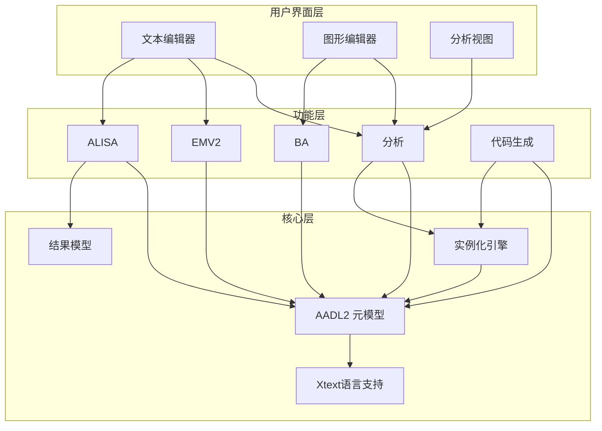
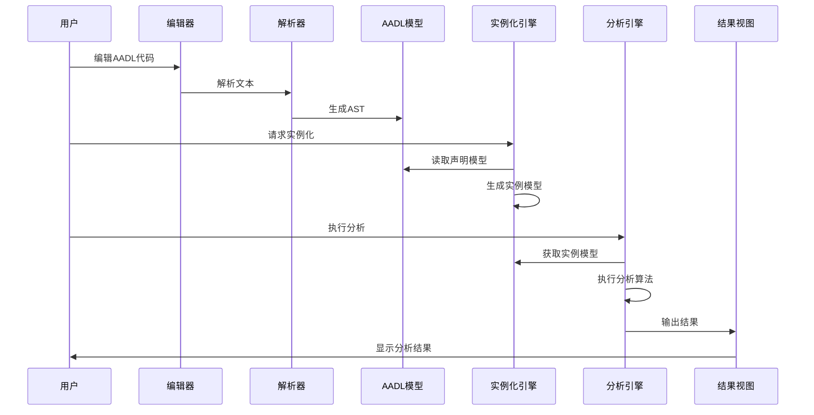

# OSATE2 核心功能模块详解

## 1. AADL建模功能

### 1.1 文本编辑器

OSATE基于Xtext框架提供强大的AADL文本编辑器。

**主要特性：**

| 功能 | 描述 |
|------|------|
| 语法高亮 | AADL关键字、类型、注释等着色显示 |
| 代码补全 | 智能上下文感知的代码提示 |
| 实时验证 | 输入时即时语法和语义检查 |
| 快速修复 | 提供常见错误的自动修复建议 |
| 重构 | 重命名、提取等重构操作 |
| 大纲视图 | 模型结构的树形展示 |
| 交叉引用 | 跳转到定义、查找引用 |
| 格式化 | 代码自动格式化 |

**相关模块：**
- `org.osate.xtext.aadl2` - 语法定义
- `org.osate.xtext.aadl2.ui` - 编辑器UI
- `org.osate.xtext.aadl2.properties` - 属性语法
- `org.osate.xtext.aadl2.properties.ui` - 属性编辑器

### 1.2 图形编辑器

OSATE图形编辑器(GE)提供可视化建模能力。

**主要特性：**

| 功能 | 描述 |
|------|------|
| 组件拖放 | 从调色板拖放创建组件 |
| 连接编辑 | 可视化创建和编辑端口连接 |
| 自动布局 | 智能排列组件位置 |
| 层次导航 | 深入/返回组件层次 |
| 双向同步 | 图形与文本模型实时同步 |
| 多图表 | 支持不同视图的多个图表 |

**相关模块：**
- `org.osate.ge` - 图形编辑器核心
- `org.osate.ge.diagram` - 图表数据模型
- `org.osate.ge.gef` - Eclipse GEF集成
- `org.osate.ge.gef.ui` - GEF UI组件

### 1.3 模型实例化

AADL模型分为声明式模型和实例模型两个层次。

**声明式模型：**
- 组件类型(Component Type)定义
- 组件实现(Component Implementation)定义
- 可复用的模板式定义

**实例模型：**
- 从声明式模型自动生成
- 展开所有子组件
- 解析所有引用
- 用于分析的具体系统表示

**相关模块：**
- `org.osate.aadl2.instantiation` - 实例化引擎
- `org.osate.aadl2.instance.textual` - 实例文本表示

## 2. 分析功能

### 2.1 延迟分析 (Latency Analysis)

计算端到端流的响应时间和延迟抖动。

**分析内容：**
- 最坏情况端到端延迟
- 延迟抖动计算
- 采样延迟分析
- 队列延迟分析
- 分区调度影响

**使用场景：**
- 验证实时性需求
- 识别性能瓶颈
- 评估调度策略

**相关模块：**
- `org.osate.analysis.flows` - 流分析核心
- `org.osate.analysis.flows.tests` - 测试

### 2.2 资源预算分析 (Resource Budget Analysis)

分析系统资源使用情况。

**分析类型：**

| 资源 | 分析内容 |
|------|----------|
| 内存 | RAM、ROM使用量 |
| 带宽 | 总线/网络带宽占用 |
| 功耗 | 电源消耗分析 |
| 处理器 | CPU利用率 |
| 重量 | 物理重量预算 |

**相关模块：**
- `org.osate.analysis.resource.budgets` - 资源预算分析
- `org.osate.analysis.resource.management` - 资源管理

### 2.3 架构分析 (Architecture Analysis)

分析系统架构的结构特性。

**分析内容：**
- 连接完整性检查
- 端口连接验证
- 绑定一致性检查
- 循环依赖检测

**相关模块：**
- `org.osate.analysis.architecture` - 架构分析核心

### 2.4 模式分析 (Mode Analysis)

分析系统运行模式。

**功能：**
- 系统运行模式(SOM)枚举
- 模式转换图生成
- 模式兼容性检查

**相关模块：**
- `org.osate.analysis.modes` - 模式分析

### 2.5 模型统计 (Model Statistics)

提供模型的统计信息。

**统计内容：**
- 组件数量统计
- 连接数量统计
- 属性使用统计
- 复杂度指标

**相关模块：**
- `org.osate.modelstats` - 统计核心
- `org.osate.modelstats.ui` - 统计UI

## 3. 安全分析功能 (EMV2)

### 3.1 错误模型 (Error Model V2)

EMV2是AADL的错误建模扩展。

**建模元素：**

| 元素 | 描述 |
|------|------|
| Error Types | 错误类型定义 |
| Error States | 组件错误状态 |
| Error Events | 错误事件 |
| Error Propagations | 错误传播路径 |
| Error Flows | 错误流 |
| Error Behavior | 错误行为状态机 |

### 3.2 故障传播分析

分析错误如何在系统中传播。

**功能：**
- 生成故障传播图
- 识别错误路径
- 分析传播影响

**相关模块：**
- `org.osate.aadl2.errormodel.propagationgraph` - 传播图生成

### 3.3 故障树分析 (FTA)

支持ARP4761标准的故障树分析。

**功能：**
- 自动生成故障树
- 故障树可视化
- 最小割集计算
- 概率分析

**相关模块：**
- `org.osate.aadl2.errormodel.faulttree` - 故障树模型
- `org.osate.aadl2.errormodel.faulttree.generation` - 故障树生成
- `org.osate.aadl2.errormodel.faulttree.design` - 故障树设计器

### 3.4 FMEA支持

支持失效模式与影响分析。

**功能：**
- 失效模式识别
- 影响分析
- 严重性评估

## 4. 验证与保证功能 (ALISA)

### 4.1 需求规范 (ReqSpec)

定义系统需求和规范。

**功能：**
- 需求定义语言
- 需求层次组织
- 需求与模型关联
- 需求追溯

**语法示例：**
```
stakeholder goals SG for MySystem [
  goal G1 : "响应时间" [
    description "系统响应时间应小于100ms"
    rationale "用户体验要求"
  ]
]
```

**相关模块：**
- `org.osate.reqspec` - 需求规范语言

### 4.2 验证计划 (Verify)

定义如何验证需求。

**功能：**
- 验证方法定义
- 验证活动规划
- 验证结果记录

**相关模块：**
- `org.osate.verify` - 验证计划语言

### 4.3 保证案例 (Assure)

管理系统保证证据。

**功能：**
- 保证案例结构
- 证据收集
- 保证评估
- 合规性报告

**相关模块：**
- `org.osate.assure` - 保证语言

### 4.4 Resolute

基于约束的结构验证语言。

**特性：**
- 声明式约束定义
- 递归规则支持
- 自定义验证函数
- 结果报告生成

**语法示例：**
```
check_latency(f: feature) <=
  ** "检查延迟是否满足要求" **
  latency(f) <= 100.0
```

**相关模块：**
- `org.osate.resolute` - Resolute核心

## 5. 行为建模功能 (BA)

### 5.1 行为附件 (Behavior Annex)

用状态机描述组件行为。

**建模元素：**

| 元素 | 描述 |
|------|------|
| States | 状态定义 |
| Transitions | 状态转换 |
| Actions | 转换动作 |
| Guards | 转换守卫条件 |
| Variables | 局部变量 |

**语法示例：**
```aadl
annex behavior_specification {**
  states
    s0 : initial state;
    s1 : state;
    s2 : final state;
  transitions
    s0 -[on dispatch]-> s1 {count := count + 1};
    s1 -[count > 10]-> s2;
**};
```

**相关模块：**
- `org.osate.ba` - 行为附件核心
- `org.osate.ge.ba` - 行为附件图形支持

## 6. 代码生成功能

### 6.1 ARINC653配置生成

从AADL模型生成ARINC653配置。

**生成内容：**
- 分区配置
- 调度表
- 通信通道配置
- 健康监控配置

### 6.2 POK支持

支持Portable Operating System Kernel原型验证。

**功能：**
- 生成POK配置文件
- 无需目标平台的早期验证

### 6.3 代码生成检查器

验证模型是否满足代码生成的先决条件。

**相关模块：**
- `org.osate.codegen.checker` - 代码生成检查器

## 7. 模型导入功能

### 7.1 导入框架

支持从其他格式导入模型。

**相关模块：**
- `org.osate.importer` - 导入框架

### 7.2 Simulink导入

从Simulink模型导入系统架构。

**相关模块：**
- `org.osate.importer.simulink` - Simulink导入器

## 8. 功能模块关系图



### 模块交互流程


