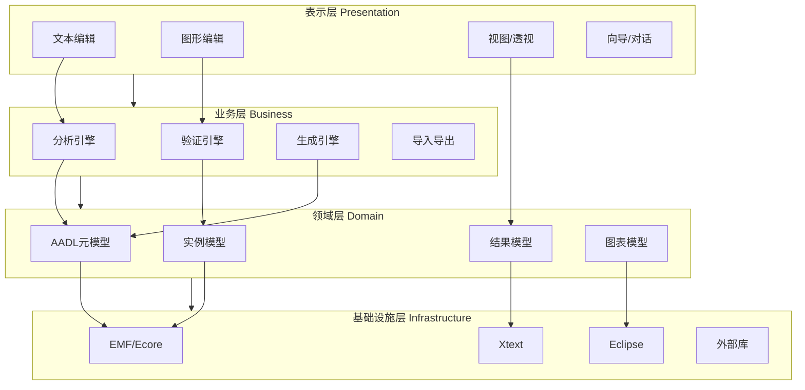
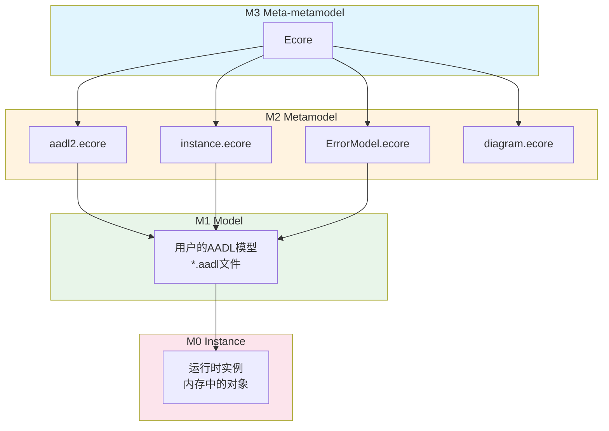
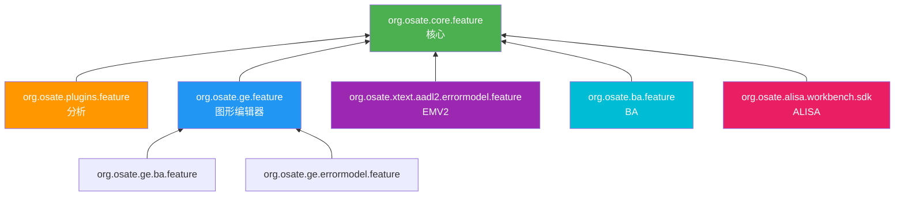
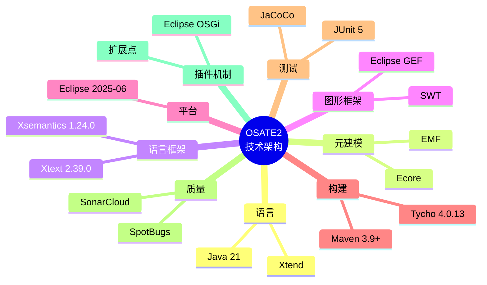
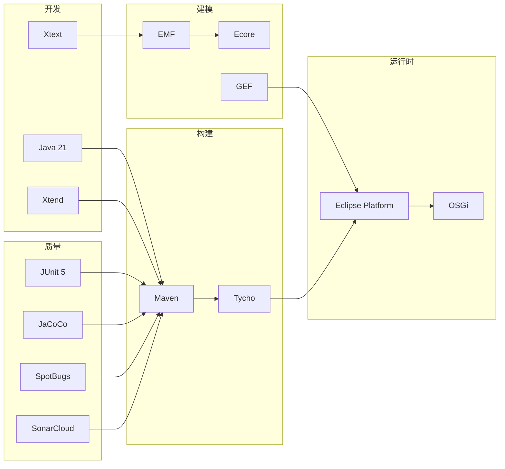

# OSATE2 技术架构

## 1. 技术栈概览

OSATE2基于Eclipse平台构建，采用多种成熟技术。

### 1.1 核心技术栈

| 层次 | 技术 | 版本 | 用途 |
|------|------|------|------|
| IDE平台 | Eclipse | 2025-06 | 基础IDE容器 |
| 语言工作台 | Xtext | 2.39.0 | 文本语言支持框架 |
| 代码生成 | Xtend | 2.39.0 | DSL实现与模板 |
| 语义框架 | Xsemantics | 1.24.0 | 类型系统定义 |
| 建模框架 | EMF/Ecore | - | 元建模框架 |
| 图形框架 | Eclipse GEF | - | 图形编辑框架 |
| UI框架 | SWT/JFace | - | 用户界面 |
| 图论库 | JGraphT | 1.5.1 | 流程/依赖分析 |
| JavaFX | OpenJFX | 17.0.2 | 高级UI组件 |

### 1.2 构建技术栈

| 工具 | 版本 | 用途 |
|------|------|------|
| Maven | 3.9.0+ | 项目管理与构建 |
| Tycho | 4.0.13 | Eclipse插件构建 |
| JaCoCo | 0.8.13 | 代码覆盖率 |
| SpotBugs | - | 静态分析 |
| SonarCloud | - | 代码质量分析 |

### 1.3 运行时要求

| 要求 | 版本 |
|------|------|
| Java | SE 21 |
| 操作系统 | Windows/macOS/Linux |
| 架构 | x86_64/ARM64 |

## 2. 架构设计

### 2.1 分层架构



### 2.2 插件架构

OSATE采用Eclipse OSGi插件架构，每个模块是独立的OSGi Bundle。

**插件结构：**
```
org.osate.modulename/
├── src/                      # Java/Xtend源代码
├── src-gen/                  # Xtext生成代码
├── xtend-gen/                # Xtend编译输出
├── model/                    # 元模型定义
│   ├── *.ecore              # Ecore模型
│   └── *.xtext              # Xtext语法
├── META-INF/
│   ├── MANIFEST.MF          # OSGi配置
│   └── plugin.properties    # 插件属性
├── plugin.xml               # 扩展点定义
├── build.properties         # 构建配置
└── pom.xml                  # Maven配置
```

### 2.3 扩展点机制

OSATE通过Eclipse扩展点机制实现可扩展性。

**主要扩展点：**

| 扩展点 | 用途 |
|--------|------|
| `org.eclipse.core.runtime.preferences` | 首选项 |
| `org.eclipse.core.resources.natures` | 项目特性 |
| `org.eclipse.core.resources.markers` | 问题标记 |
| `org.eclipse.xtext.builder.participant` | 构建参与 |
| `org.eclipse.core.contenttype.contentTypes` | 内容类型 |
| `org.eclipse.ui.views` | 视图 |
| `org.eclipse.ui.editors` | 编辑器 |

## 3. 元建模架构

### 3.1 Ecore元模型

OSATE使用EMF Ecore定义领域模型。

**核心元模型：**

| 元模型 | 文件 | 描述 |
|--------|------|------|
| AADL2 | `aadl2.ecore` | AADL核心语言模型 |
| Instance | `instance.ecore` | 实例模型 |
| Error Model | `ErrorModel.ecore` | EMV2模型 |
| Diagram | `diagram.ecore` | 图表模型 |
| Analysis | `analysis.ecore` | 分析结果模型 |
| Fault Tree | `faulttree.ecore` | 故障树模型 |

### 3.2 元模型层次



## 4. Xtext语言架构

### 4.1 语言定义

OSATE使用Xtext定义文本语法。

**语法文件：**

| 语言 | 文件 | 描述 |
|------|------|------|
| AADL2 | `Aadl2.xtext` | 核心AADL语法 |
| Properties | `Properties.xtext` | 属性语法 |
| Error Model | `ErrorModel.xtext` | EMV2语法 |
| Behavior | - | 行为附件语法 |
| ReqSpec | `ReqSpec.xtext` | 需求规范语法 |
| Verify | `Verify.xtext` | 验证计划语法 |
| Assure | `Assure.xtext` | 保证语法 |
| Common | `Common.xtext` | ALISA通用语法 |

### 4.2 Xtext生成的组件

Xtext从语法定义自动生成：

| 组件 | 用途 |
|------|------|
| Parser | 语法解析器 |
| Lexer | 词法分析器 |
| AST | 抽象语法树 |
| Linker | 交叉引用链接 |
| Validator | 验证器 |
| Formatter | 格式化器 |
| Content Assist | 内容辅助 |
| Outline | 大纲 |

## 5. 构建系统

### 5.1 Maven + Tycho

OSATE使用Maven作为项目管理工具，Tycho作为Eclipse插件构建插件。

**构建配置层次：**

```
osate2/pom.xml (根POM)
    └── releng/org.osate.build.main/pom.xml (父POM)
        ├── core/*/pom.xml
        ├── analyses/*/pom.xml
        ├── alisa/*/pom.xml
        ├── emv2/*/pom.xml
        ├── ba/*/pom.xml
        ├── ge/*/pom.xml
        └── ...
```

### 5.2 构建模块类型

| 打包类型 | 用途 |
|----------|------|
| `eclipse-plugin` | Eclipse插件 |
| `eclipse-feature` | Eclipse特性 |
| `eclipse-test-plugin` | 测试插件 |
| `eclipse-repository` | P2更新站点 |
| `eclipse-target-definition` | 目标平台 |

### 5.3 目标平台

目标平台定义了构建所需的Eclipse依赖。

**位置：** `releng/org.osate.build.target/`

**主要依赖：**
- Eclipse Platform 2025-06
- Xtext 2.39.0
- EMF
- GEF

### 5.4 构建命令

```bash
# 完整构建
mvn clean verify

# 跳过测试
mvn clean verify -DskipTests

# 仅构建特定模块
mvn clean verify -pl core/org.osate.aadl2
```

## 6. 质量保证

### 6.1 测试框架

| 框架 | 用途 |
|------|------|
| JUnit 5 | 单元测试 |
| Eclipse Surefire | 测试执行 |
| Xtext Testing | 语言测试 |

**测试模块命名：**
- `org.osate.*.tests` - 测试插件

### 6.2 代码覆盖率

使用JaCoCo进行代码覆盖率分析。

**配置位置：** `releng/org.osate.build.coverage.report/`

### 6.3 静态分析

| 工具 | 用途 |
|------|------|
| SpotBugs | Bug检测 |
| SonarCloud | 代码质量 |
| Eclipse警告 | 编译时检查 |

## 7. 特性(Feature)组织

### 7.1 特性列表

| 特性 | 描述 |
|------|------|
| `org.osate.core.feature` | 核心功能 |
| `org.osate.xtext.aadl2.errormodel.feature` | EMV2支持 |
| `org.osate.ba.feature` | 行为附件支持 |
| `org.osate.utils.feature` | 工具集 |
| `org.osate.ge.feature` | 图形编辑器 |
| `org.osate.ge.ba.feature` | GE行为附件支持 |
| `org.osate.ge.errormodel.feature` | GE错误模型支持 |
| `org.osate.plugins.feature` | 分析插件 |
| `org.osate.examples.feature` | 示例 |
| `org.osate.alisa.workbench.sdk` | ALISA SDK |
| `org.osate.license` | 许可证 |

### 7.2 特性依赖关系



## 8. 发布机制

### 8.1 产品定义

**位置：** `releng/org.osate.build.product/`

产品定义包括：
- 品牌信息
- 启动配置
- 包含的特性
- 平台配置

### 8.2 P2更新站点

**位置：** `releng/org.osate.build.repository/`

生成Eclipse P2更新站点，用于：
- 在线安装
- 离线安装包
- 增量更新

### 8.3 多平台支持

| 平台 | 架构 |
|------|------|
| Windows | x86_64 |
| macOS | x86_64, ARM64 |
| Linux | x86_64, ARM64 |

## 9. 持续集成

### 9.1 CI配置

项目使用GitHub Actions或类似CI系统。

**主要任务：**
- 自动构建
- 测试执行
- 代码覆盖率
- 静态分析
- 发布构建

### 9.2 SonarCloud集成

通过SonarCloud进行持续代码质量分析。

**监控指标：**
- 代码覆盖率
- 代码重复
- 代码异味
- 安全漏洞
- Bug检测

## 10. 技术架构总结



### 技术栈全景图


