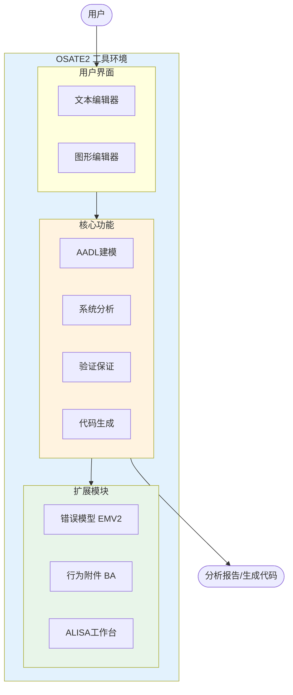

# OSATE2 项目分析文档

本文档集对 OSATE2 (Open Source AADL Tool Environment) 项目进行深入分析。

## 文档目录

### 总览文档

| 文档 | 描述 |
|------|------|
| [📑 子项目索引](00_子项目索引.md) | **所有子项目概览、依赖关系、学习路径** ⭐ |
| [项目概述](01_项目概述.md) | OSATE和AADL简介、历史背景、应用领域 |
| [代码结构分析](02_代码结构分析.md) | 项目目录结构、模块划分、依赖关系 |
| [核心功能模块](03_核心功能模块.md) | 各功能模块详细分析 |
| [技术架构](04_技术架构.md) | 技术栈、构建系统、扩展机制 |
| [开发指南](05_开发指南.md) | 开发环境、构建方法、扩展开发 |

### 子项目详细文档

| 子项目 | 描述 | 重要性 |
|--------|------|--------|
| [Core - 核心模块](core/README.md) | AADL元模型、解析器、实例化引擎 | ⭐⭐⭐⭐⭐ |
| [Analyses - 分析模块](analyses/README.md) | 流分析、资源预算、架构分析 | ⭐⭐⭐⭐⭐ |
| [EMV2 - 错误模型](emv2/README.md) | 错误建模、故障树、安全性分析 | ⭐⭐⭐⭐⭐ |
| [ALISA - 验证框架](alisa/README.md) | 需求管理、验证计划、保证案例 | ⭐⭐⭐⭐ |
| [GE - 图形编辑器](ge/README.md) | 可视化建模、图形编辑 | ⭐⭐⭐⭐ |
| [BA - 行为附件](ba/README.md) | 行为状态机、动作序列 | ⭐⭐⭐ |
| [Releng - 发布工程](releng/README.md) | 构建系统、持续集成 | ⭐⭐⭐⭐ |
| [Examples - 示例项目](examples/README.md) | 教学示例、最佳实践 | ⭐⭐⭐⭐ |
| [Setup - 环境配置](setup/README.md) | Oomph配置、开发环境 | ⭐⭐⭐ |
| [Tools - 工具集](tools/README.md) | 代码生成器、开发工具 | ⭐⭐⭐ |

## 项目快速概览

**OSATE2** 是由卡内基梅隆大学软件工程研究所(SEI)维护的开源AADL工具环境，用于嵌入式实时系统的架构建模、分析和代码生成。

### 核心数据

| 项目属性 | 值 |
|----------|-----|
| 当前版本 | 2.18.0-SNAPSHOT |
| 许可证 | Eclipse Public License 2.0 |
| 基础平台 | Eclipse 2025-06 |
| 主要语言 | Java、Xtend |
| 子模块数 | 148个 |
| Java文件 | 3,989个 |

### 主要功能

1. **AADL建模** - 支持文本和图形化建模
2. **系统分析** - 延迟分析、资源预算、安全分析
3. **验证保证** - 需求规范、形式化验证
4. **代码生成** - ARINC653配置生成

## 参考资源

- 官方网站: https://osate.org
- GitHub仓库: https://github.com/osate/osate2
- 邮件列表: https://groups.google.com/g/osate
- SEI AADL页面: https://www.sei.cmu.edu/projects/architecture-analysis-and-design-language-aadl/
