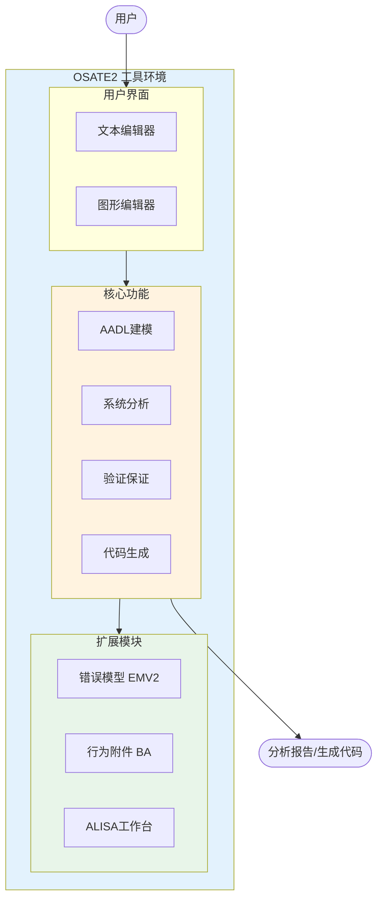
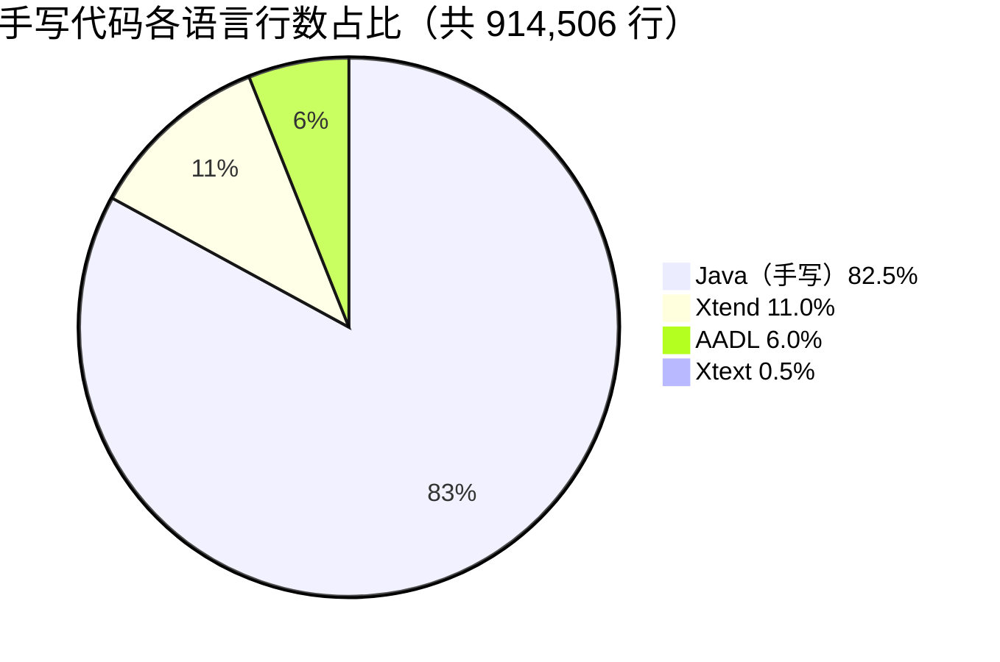
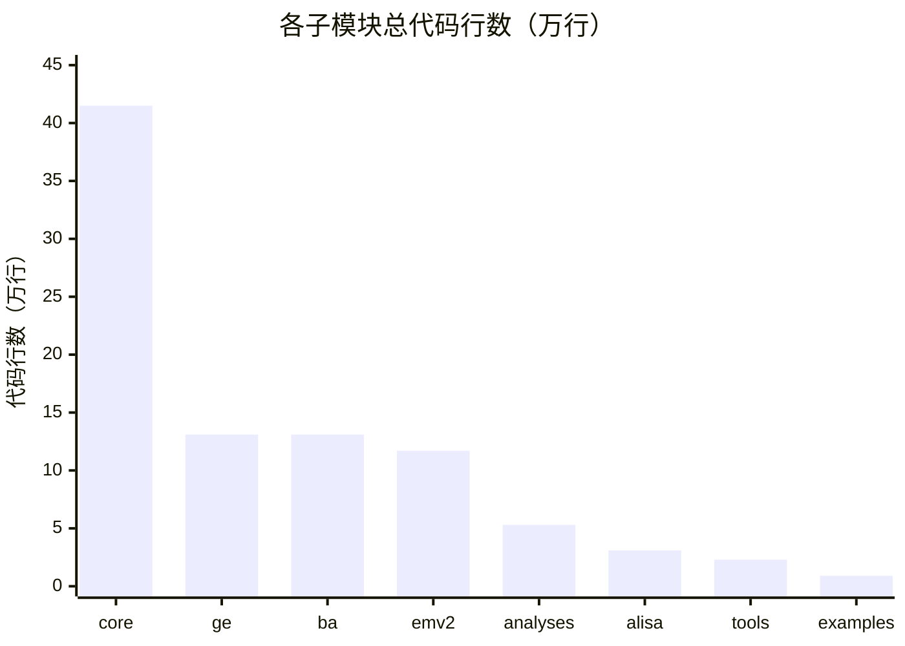
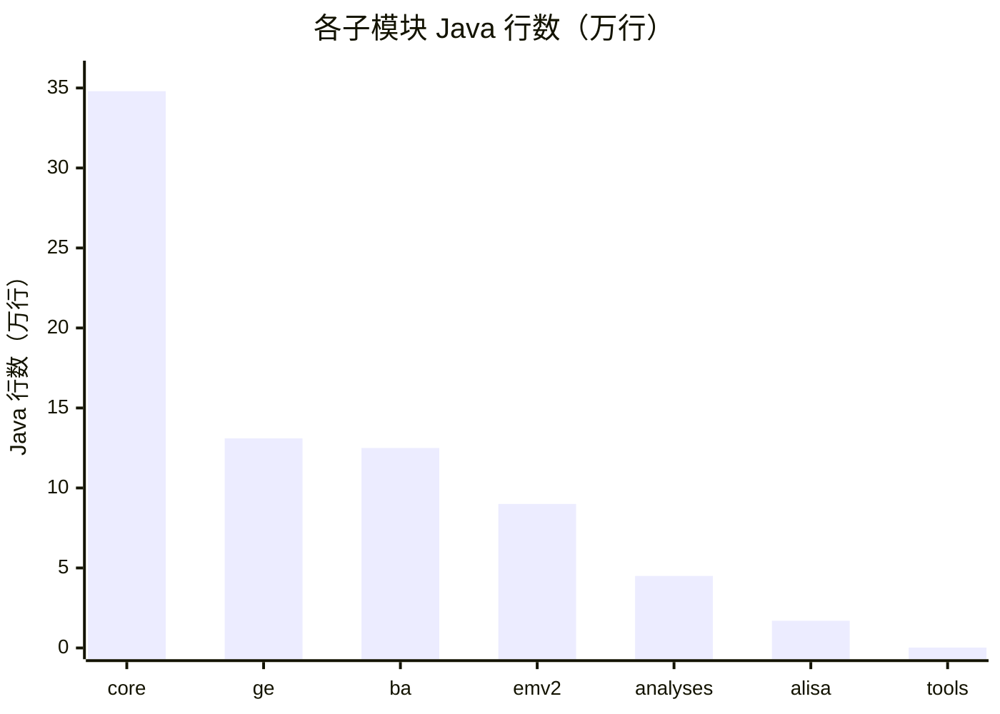
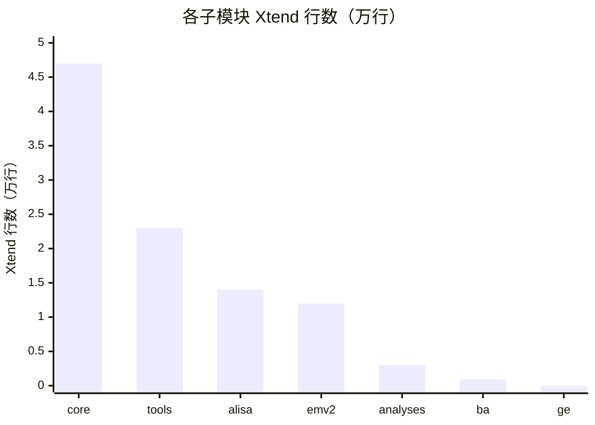
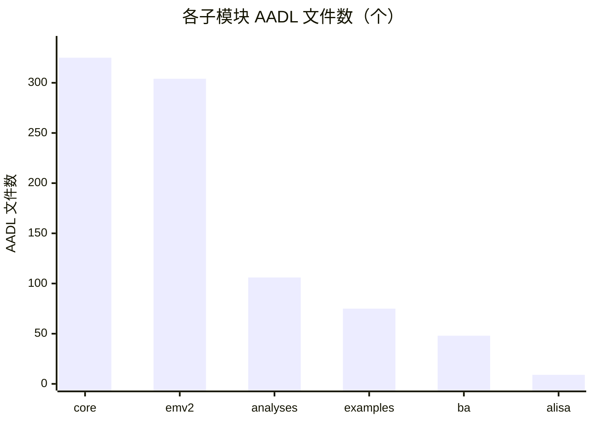
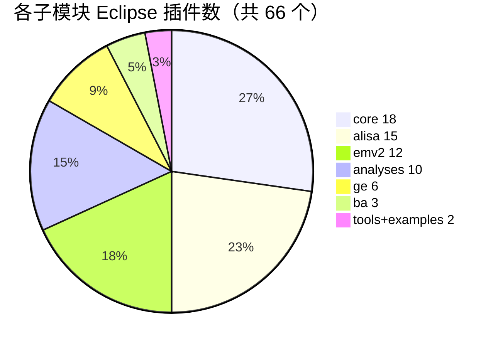

# OSATE2 项目分析文档

本文档集对 OSATE2 (Open Source AADL Tool Environment) 项目进行深入分析。

## 文档目录

### 总览文档

| 文档 | 描述 |
|------|------|
| [📑 子项目索引](00_子项目索引.md) | **所有子项目概览、依赖关系、学习路径** ⭐ |
| [项目概述](01_项目概述.md) | OSATE和AADL简介、历史背景、应用领域 |
| [代码结构分析](02_代码结构分析.md) | 项目目录结构、模块划分、依赖关系 |
| [核心功能模块](03_核心功能模块.md) | 各功能模块详细分析 |
| [技术架构](04_技术架构.md) | 技术栈、构建系统、扩展机制 |
| [开发指南](05_开发指南.md) | 开发环境、构建方法、扩展开发 |

### 源码级设计文档

基于源码深入分析的设计文档，覆盖核心子系统的内部架构与实现细节：

| 文档 | 描述 |
|------|------|
| [AADL2 元模型设计](06_AADL2元模型设计.md) | Ecore 元模型类层次、Type-Implementation 分离、Feature/Connection/Flow/Property 建模、实例模型设计 |
| [实例化引擎设计](07_实例化引擎设计.md) | InstantiateModel 八阶段流程、连接多段追踪、SOM 枚举、属性缓存、性能优化 |
| [Xtext 语言集成设计](08_Xtext语言集成设计.md) | 非标准 Xtext 架构、双语法层次、多层作用域、Annex 解析集成、RuntimeModule 绑定 |
| [分析框架设计](09_分析框架设计.md) | Handler 层次、触发流程、Result 元模型、流延迟分析算法、Marker 生成、扩展模式 |
| [EMV2 错误模型与图形编辑器设计](10_EMV2错误模型与图形编辑器设计.md) | EMV2 语法/类型系统/状态机、故障树生成算法、传播图、GE Business Object Handler 模式、双向同步 |
| [ALISA 验证框架与 Annex 支持设计](11_ALISA验证框架与Annex支持设计.md) | ReqSpec/Verify/Alisa/Assure 四层流水线、验证方法类型、需求追溯、Annex 注册表体系 |
| [行为附件设计](12_行为附件设计.md) | ANTLR 4.4 语法、BehaviorAnnex 元模型、动作语言、状态机验证、GE 集成 |
| [UI 框架与导航设计](13_UI框架与导航设计.md) | AADL 导航器、属性视图、向导框架、首选项页面、错误 Marker 框架、命令/Handler 体系 |
| [构建系统与测试设计](14_构建系统与测试设计.md) | Maven/Tycho 构建层次、目标平台、测试基础设施、产品打包、CI/CD 流水线、代码生成 |
| [属性系统深入分析](15_属性系统深入分析.md) | PropertyType/Expression 层次、属性求值流程、PropertyUtils/GetProperties API、模态属性值处理、自定义属性集开发 |

### 子项目详细文档

| 子项目 | 描述 | 重要性 |
|--------|------|--------|
| [Core - 核心模块](core/README.md) | AADL元模型、解析器、实例化引擎 | ⭐⭐⭐⭐⭐ |
| [Analyses - 分析模块](analyses/README.md) | 流分析、资源预算、架构分析 | ⭐⭐⭐⭐⭐ |
| [EMV2 - 错误模型](emv2/README.md) | 错误建模、故障树、安全性分析 | ⭐⭐⭐⭐⭐ |
| [ALISA - 验证框架](alisa/README.md) | 需求管理、验证计划、保证案例 | ⭐⭐⭐⭐ |
| [GE - 图形编辑器](ge/README.md) | 可视化建模、图形编辑 | ⭐⭐⭐⭐ |
| [BA - 行为附件](ba/README.md) | 行为状态机、动作序列 | ⭐⭐⭐ |
| [Releng - 发布工程](releng/README.md) | 构建系统、持续集成 | ⭐⭐⭐⭐ |
| [Examples - 示例项目](examples/README.md) | 教学示例、最佳实践 | ⭐⭐⭐⭐ |
| [Setup - 环境配置](setup/README.md) | Oomph配置、开发环境 | ⭐⭐⭐ |
| [Tools - 工具集](tools/README.md) | 代码生成器、开发工具 | ⭐⭐⭐ |

## 项目快速概览

**OSATE2** 是由卡内基梅隆大学软件工程研究所(SEI)维护的开源AADL工具环境，用于嵌入式实时系统的架构建模、分析和代码生成。


```mermaid
graph TB
    subgraph OSATE2[OSATE2 工具环境]
        subgraph UI[用户界面]
            TextEditor[文本编辑器]
            GraphEditor[图形编辑器]
        end

        subgraph Functions[核心功能]
            Modeling[AADL建模]
            Analysis[系统分析]
            Verification[验证保证]
            CodeGen[代码生成]
        end

        subgraph Extensions[扩展模块]
            EMV2[错误模型 EMV2]
            BA[行为附件 BA]
            ALISA[ALISA工作台]
        end
    end

    User([用户]) --> UI
    UI --> Functions
    Functions --> Extensions
    Functions --> Output([分析报告/生成代码])

    style OSATE2 fill:#e3f2fd
    style Functions fill:#fff3e0
    style Extensions fill:#e8f5e9
```

### 核心数据

| 项目属性 | 值 |
|----------|-----|
| 当前版本 | 2.18.0-SNAPSHOT |
| 许可证 | Eclipse Public License 2.0 |
| 基础平台 | Eclipse 2025-06 |
| 主要语言 | Java、Xtend |
| Eclipse 插件数 | 106 个（含测试插件） |
| Eclipse Feature 数 | 11 个 |
| Java 文件（手写） | 3,430 个 |
| Java 文件（EMF 生成） | 559 个 |

## 代码统计

> **统计方法说明**：
> - 排除了 `target/`、`src-gen/`、`xtend-gen/` 等构建产物目录
> - Java 手写代码不含 EMF Xtext 框架从 ecore/genmodel 自动生成的 `src-gen/` 文件
> - AADL 统计含属性集定义（`.aadl`）、测试用例和示例

### 全项目代码量汇总

| 语言 / 类型 | 文件数（个） | 代码行数（行） | 说明 |
|-------------|------------:|-------------:|------|
| **Java**（手写） | 3,430 | 754,691 | 核心实现、分析算法、UI |
| **Java**（EMF 生成，src-gen） | 559 | — | 由 Xtext/genmodel 自动生成 |
| **Xtend** | 393 | 100,210 | 代码生成器、分析器、Xtext 组件 |
| **Xtext** | 10 | 4,711 | 7 套领域特定语言语法（AADL、EMV2、ReqSpec 等） |
| **AADL** | 867 | 54,894 | 属性集、测试模型、示例模型 |
| **Ecore 元模型** | 19 | — | EMF 元模型定义（.ecore） |
| **GenModel** | 20 | — | EMF 代码生成配置（.genmodel） |
| **合计（手写）** | **4,700** | **914,506** | Java + Xtend + Xtext + AADL |


```mermaid
pie title 手写代码各语言行数占比（共 914,506 行）
    "Java（手写）82.5%" : 754691
    "Xtend 11.0%" : 100210
    "AADL 6.0%" : 54894
    "Xtext 0.5%" : 4711
```

### 各子模块代码统计

> 说明：Java 行数为手写代码（排除 src-gen/xtend-gen），数据来自 `osate2/` 下各子目录。

| 子模块 | Java 文件（个） | Java 行数（行） | Xtend 文件（个） | Xtend 行数（行） | AADL 文件（个） | AADL 行数（行） | Xtext 语法（个） | 插件数（个） |
|--------|---------------:|---------------:|-----------------:|-----------------:|----------------:|----------------:|-----------------:|-------------:|
| **core** | 1,410 | 347,533 | 185 | 47,121 | 325 | 20,259 | 3 | 18 |
| **ge** | 987 | 130,898 | 0 | 0 | 0 | 0 | 0 | 6 |
| **ba** | 433 | 124,587 | 19 | 862 | 48 | 5,322 | 0 | 3 |
| **emv2** | 279 | 90,018 | 38 | 12,497 | 304 | 14,528 | 1 | 12 |
| **analyses** | 228 | 44,729 | 22 | 3,254 | 106 | 5,358 | 0 | 10 |
| **alisa** | 89 | 16,730 | 102 | 13,721 | 9 | 642 | 6 | 15 |
| **tools** | 4 | 196 | 27 | 22,755 | 0 | 0 | 0 | 1 |
| **examples** | 0 | 0 | 0 | 0 | 75 | 8,785 | 0 | 1 |
| **releng** | 0 | 0 | 0 | 0 | 0 | 0 | 0 | 0 |
| **setup** | 0 | 0 | 0 | 0 | 0 | 0 | 0 | 0 |
| **合计** | **3,430** | **754,691** | **393** | **100,210** | **867** | **54,894** | **10** | **66** |

> 各子模块 Java + Xtend + AADL 手写行数之和，单位：万行


```mermaid
xychart-beta
    title "各子模块总代码行数（万行）"
    x-axis ["core", "ge", "ba", "emv2", "analyses", "alisa", "tools", "examples"]
    y-axis "代码行数（万行）" 0 --> 45
    bar [41.5, 13.1, 13.1, 11.7, 5.3, 3.1, 2.3, 0.9]
```


```mermaid
xychart-beta
    title "各子模块 Java 行数（万行）"
    x-axis ["core", "ge", "ba", "emv2", "analyses", "alisa", "tools"]
    y-axis "Java 行数（万行）" 0 --> 36
    bar [34.8, 13.1, 12.5, 9.0, 4.5, 1.7, 0.02]
```


```mermaid
xychart-beta
    title "各子模块 Xtend 行数（万行）"
    x-axis ["core", "tools", "alisa", "emv2", "analyses", "ba", "ge"]
    y-axis "Xtend 行数（万行）" 0 --> 5
    bar [4.7, 2.3, 1.4, 1.2, 0.3, 0.09, 0]
```


```mermaid
xychart-beta
    title "各子模块 AADL 文件数（个）"
    x-axis ["core", "emv2", "analyses", "examples", "ba", "alisa"]
    y-axis "AADL 文件数" 0 --> 340
    bar [325, 304, 106, 75, 48, 9]
```


```mermaid
pie title 各子模块 Eclipse 插件数（共 66 个）
    "core 18" : 18
    "alisa 15" : 15
    "emv2 12" : 12
    "analyses 10" : 10
    "ge 6" : 6
    "ba 3" : 3
    "tools+examples 2" : 2
```

### 代码规模观察

**按 Java 代码量排序（前四）**：
1. **core**（347,533 行）— 约占全项目 Java 代码的 **46%**，包含 AADL2 元模型、Xtext 语言框架和实例化引擎；EMF 生成的 `*Impl` 类贡献了其中大部分体积
2. **ge**（130,898 行）— 图形编辑器完全用 Java + JavaFX 实现，无 Xtend 代码
3. **ba**（124,587 行）— 行为附件的元模型和 EMF 实现体积较大
4. **emv2**（90,018 行）— 错误模型含大量自动生成的 FaultTree 元模型实现

**Xtend 重度使用模块**：
- **tools**（22,755 行）— 属性代码生成器几乎全用 Xtend 的模板表达式实现
- **core**（47,121 行）— Xtext 运行时绑定、作用域提供器、生成器均用 Xtend 编写
- **alisa**（13,721 行）— ALISA 执行引擎（AssureProcessor）和表达式解释器均为 Xtend

**DSL 数量（Xtext 语法文件）**：共 10 个，按子模块分布：
- core（3 个）：AADL2、AADL2 Properties、AADL2 Instance Textual
- alisa（6 个）：Common、Categories、Organization、ReqSpec、Verify、Alisa（工作台）
- emv2（1 个）：Error Model Annex

**AADL 文件分布**：
- **core**（325 个）— 预定义属性集（`*_Properties.aadl`）和 SEI 属性集是最大来源
- **emv2**（304 个）— 大量错误模型测试用例（`.aadl` + 注解）
- **analyses**（106 个）— 分析驱动的测试模型
- **examples**（75 个）— 对外发布的示例模型

**测试覆盖**：
- 包含 `@Test` 注解的 JUnit 测试类：**78 个**
- 测试插件（`*.tests` 命名）广泛分布于 core、analyses、emv2、alisa 各子模块

### 主要功能

1. **AADL建模** - 支持文本和图形化建模
2. **系统分析** - 延迟分析、资源预算、安全分析
3. **验证保证** - 需求规范、形式化验证
4. **代码生成** - ARINC653配置生成

## 项目综合评估

### 规模评估

| 维度 | 数值 | 行业参照 |
|------|------|---------|
| 手写代码总量 | 914,506 行 | 属于**大型工程软件**级别 |
| Eclipse 插件数（个） | 106 | Eclipse 生态中属于**重量级**产品 |
| DSL 数量（套） | 10 | 语言工程能力**罕见**于开源项目 |
| 元模型文件（个） | 19 | 领域模型体系**完整** |
| 活跃子模块（个） | 8 | 边界清晰，职责分离较好 |

OSATE2 是一个**百万行级的专业工具平台**，规模接近中型商业 IDE。对于一个学术机构（CMU SEI）主导的开源项目，这一体量相当可观。

### 各模块代码分布的结构性观察

```
core     ████████████████████████████████████████  41.5 万行（45%）
ge       █████████████                             13.1 万行（14%）
ba       █████████████                             13.1 万行（14%）
emv2     ████████████                              11.7 万行（13%）
analyses █████                                      5.3 万行（6%）
alisa    ███                                        3.1 万行（3%）
tools    ██                                         2.3 万行（3%）
```

**core 模块过重**：core 占全部 Java 代码的 46%，但其中 EMF 生成代码（src-gen）贡献了约 696,395 行，是真正手写量（347,533 行）的 2 倍。这是 EMF 框架的固有特性（为每个 EClass 生成大量 `*Impl`、`*Package`、`*Factory`），并非设计问题，但会带来维护上的认知负担。

**ge 模块体量偏大**：图形编辑器（ge）有 987 个 Java 文件、130,898 行，且完全没有 Xtend，说明全部是手写 Java。图形编辑器历来是 Eclipse 生态中最难维护的部分，如此体量意味着较高的维护成本。

**analyses 模块相对轻量**：核心价值所在的 analyses 模块（流延迟、资源预算分析）只有 44,729 行 Java，说明分析算法本身的实现是精炼的，框架抽象做得较好。

**tools 是最小却 Xtend 最密集的模块**：tools 只有 196 行 Java，但有 22,755 行 Xtend——属性代码生成器几乎 100% 用 Xtend 模板表达式实现，这是 Xtend 模板语法的典型高效应用。

### 语言选择评估

| 语言 | 占比 | 评价 |
|------|------|------|
| Java（手写） | 82.5% | **稳定**，生态成熟，但代码量大 |
| Xtend | 11.0% | **合适**，模板表达式大幅减少样板代码 |
| AADL | 6.0% | **必要**，自举式验证 |
| Xtext | 0.5% | **高产出低投入**，10 个文件驱动 10 套 DSL |

Xtext 的使用是项目的最大技术亮点：用 10 个语法文件驱动了解析器、词法器、内容辅助、格式化器等整套工具链的自动生成，大幅降低了语言工具的开发成本。

### 测试覆盖评估

| 指标 | 数值 | 评价 |
|------|------|------|
| JUnit 测试类（个） | 78 | 相对于 3,430 个 Java 文件，**覆盖率偏低** |
| 测试 AADL 模型（个） | 400+ | emv2（304 个）、analyses（106 个）靠模型测试补充 |
| 代码覆盖工具 | JaCoCo | 有基础设施，但覆盖率数值未知 |

78 个测试类对应 3,430 个 Java 文件（约 1:44 的比例）是偏低的，尤其对于安全关键领域工具。不过 AADL 模型文件（867 个）可以视为集成测试的输入，在一定程度上弥补了单元测试的不足。

### 架构设计评估

**优势：**
- **分层清晰**：四层架构（表示层→业务层→领域层→基础设施层）职责分离明确
- **扩展性好**：Eclipse 扩展点机制使第三方可以在不修改核心代码的情况下添加新分析
- **DSL 体系完整**：10 套 DSL 覆盖了建模→需求→验证→保证的完整闭环
- **元模型驱动**：19 个 Ecore 元模型作为统一的数据表示，支持 XMI 序列化和跨工具互操作

**劣势：**
- **Eclipse 平台绑定深**：深度依赖 OSGi/Eclipse 插件体系，几乎不可能脱离 Eclipse 运行，限制了工具在 CI/CD、无头批处理场景下的使用
- **GE 模块耦合重**：130,898 行纯手写 Java 的图形编辑器，与 EMF/GEF 深度耦合，历史维护难度高
- **BA 模块体量异常**：行为附件（ba）有 124,587 行 Java，几乎与图形编辑器相当，但其功能定位（行为状态机）并不复杂，可能存在过度实现
- **Xtend 的双刃剑**：Xtend 提升了开发效率，但在 Java 生态逐渐弱化对 Xtend 支持的背景下，长期维护存在风险

### 综合评分

| 维度 | 评分 | 依据 |
|------|------|------|
| 功能完整性 | ★★★★★ | 建模、分析、验证、代码检查完整覆盖 |
| 架构清晰度 | ★★★★☆ | 分层清晰，但 Eclipse 依赖过深 |
| 测试健壮性 | ★★★☆☆ | 测试类数量不足，靠 AADL 模型文件补充 |
| 构建工程化 | ★★★★★ | Maven/Tycho/JaCoCo/SpotBugs/SonarCloud 完整 |
| 可扩展性 | ★★★★★ | Eclipse 扩展点体系成熟，第三方插件丰富 |
| 可移植性 | ★★☆☆☆ | 强绑定 Eclipse，无法独立运行 |
| 领域深度 | ★★★★★ | 对 AADL 标准的覆盖极为深入、准确 |

### 总体结论

OSATE2 是一个**领域深度极强、工程成熟度高、但平台绑定较重**的专业工具。它代表了基于 Eclipse/EMF/Xtext 技术栈能达到的较高水平，在航空航天、国防等安全关键系统领域具有不可替代的地位。

主要限制在于：其百万行级体量和深度的 Eclipse 依赖使得新贡献者的入门曲线极陡，且随着 Eclipse RCP 生态在 2020 年代的整体式微，项目的长期用户增长面临挑战。测试覆盖率相对于安全关键工具的定位也有待提升。

## 参考资源

- 官方网站: https://osate.org
- GitHub仓库: https://github.com/osate/osate2
- 邮件列表: https://groups.google.com/g/osate
- SEI AADL页面: https://www.sei.cmu.edu/projects/architecture-analysis-and-design-language-aadl/
